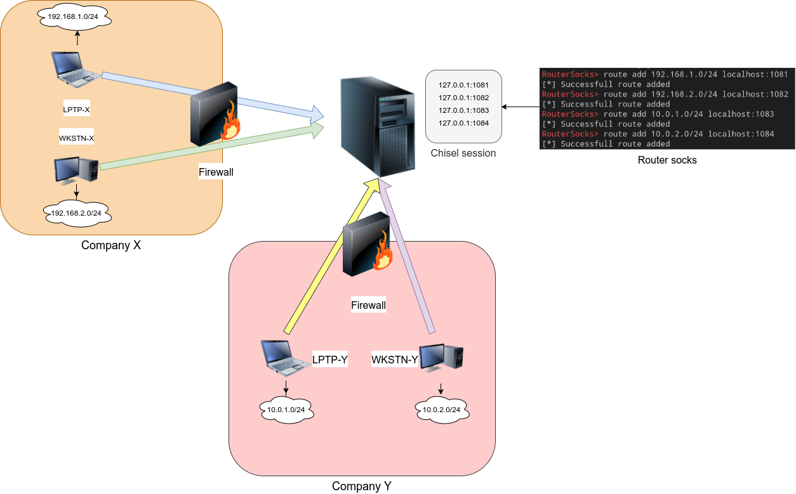

Router socks
======

The next step after compromising a machine is to enumerate the network behind. Many tools exist to expose a socks port on the attacker's machine and send all the traffic through a tunnel to the compromised machine. When several socks ports are available, we have to manage different proxychains configuration to choose the targeted network. 
This tool will expose one socks port and route the traffic through the configured path.


The idea came after using [chisel](https://github.com/jpillora/chisel). Chisel is really helpful but it can get hard to manage many clients as it is opening a new socks port for each new client with reverse mode.



## Usage

Start the socks server:

```
Usage:
  rsocks [flags]

Flags:
  -h, --help        help for rsocks
  -i, --ip string   IP for socks5 server (default "0.0.0.0")
  -p, --port int    Socks5 port (default 1080)
```
Define the routes:
```
RouterSocks> help
route: Manage route to socks servers
chisel: Liste chisel socks server on localhost
help: help command
RouterSocks> route add 192.168.1.0/24 10.0.0.1:1081
[*] Successfull route added
RouterSocks> chisel
[0] 127.0.0.1:1081
RouterSocks> route add 192.168.2.0/24 0
[*] Successfull route added
RouterSocks> route
192.168.1.0/24 => 10.0.0.1:1081
192.168.2.0/24 => 127.0.0.1:1081
```

## Features
- Route network through remote or local socks server
- Use chisel session ID
